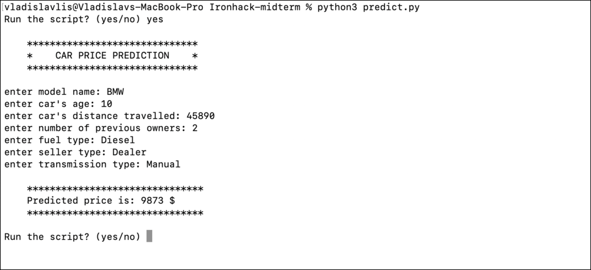

# Car Price Prediction Model

A linear regression model developed to predict the prices of used cars.

* To view all stages with comments, open `predict.ipynb` with Jupyter Notebook or an IDE that supports a Jupyter Python kernel ([instructions](#view-notebook-predictipynb) below)   
No additional configuration should be required when using a conda environment and a conda Python kernel.  
* To run the script (`predict.py`) in the terminal, please follow the [instructions](#run-locally-predictpy) below.

`predict.py` prompts for user input to make a prediction.  
`predict.ipynb` contains all stages of model development along with comments. The final function, which prompts for input and outputs the prediction, can be found at the end of the notebook.

## Preview
* Sample execution of `predict.py` via the terminal:  

* Sample execution of the final function in `predict.ipynb` via Jupyter Notebook:  

## Run locally (predict.py)
1. Clone the repository.
2. While in the root directory, install the dependencies via the terminal with `$ pip install -r requirements.txt` (also contains dependencies for the notebook).
3. While in the root directory, run `python3 predict.py` (macOS) or `$ python predict.py` (Windows)  
   **Please note** that `predict.py` contains redundant code that creates the initial and input data frames.
   This is intentionally left for demonstration purposes (code review) and will slightly slow down the initial execution of the script (usually by around 15 seconds, depending on your machine).

## View notebook (predict.ipynb) 
1. Clone the repository.
2. To preview:
   - With Jupyter Notebook: Simply open the file in Jupyter Notebook; nothing extra is required.  
   - With VSCode: 
     - Install Jupyter extension.
     - While in the root directory, install the dependencies: `$ pip install -r requirements.txt`.
     - Switch to the conda Python kernel.

## Dataset
The [Vehicle dataset](https://www.kaggle.com/datasets/nehalbirla/vehicle-dataset-from-cardekho) can be found on Kaggle.

The combined dataset consists of up to 14,828 rows spread across 4 CSV files (approximately 10,485 after data cleaning).
Each CSV file has a different number of columns, different header names, and different data formatting.
The number of columns ranges from 8 to 20.
